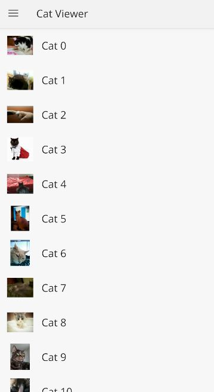
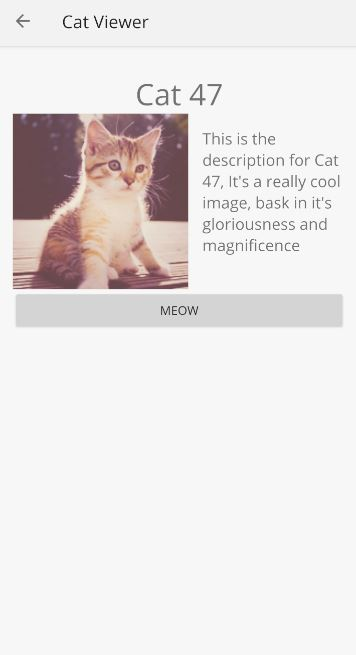
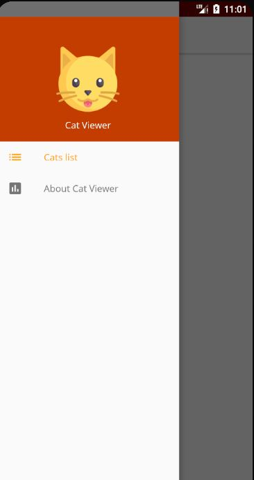
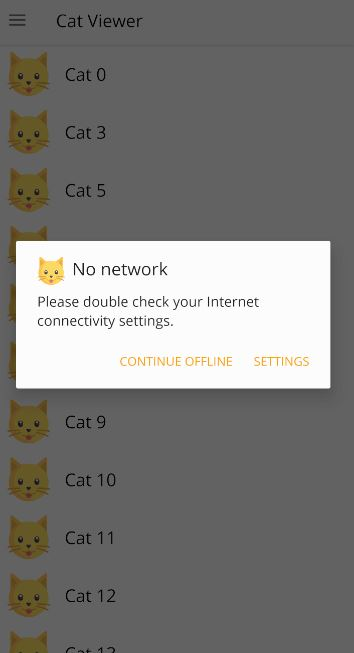
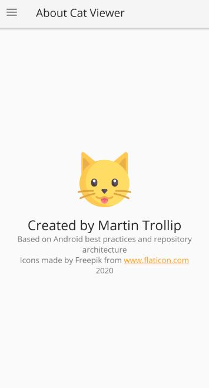

# cat-viewer

## Architecture

This application displays a list of cats and some information about them.  This implementation is based on the [repository pattern](https://developer.android.com/jetpack/docs/guide) and Android best practices.  The repository pattern is visually represented below

This is a single Activity application with fragments.  Each fragment is controlled by a ViewModel with Live data.  The data repository provides the front end with data which is cached locally (in a Room database) after being retrieved form a remote source using Retrofit and Coroutines.  The data is presented to the View using LiveData.  This enables the app to be used in offline mode after the initial data has been downloaded.

The app makes use of the JetPack Navigation controller to easily control the flow and the data passed between screens.

The images are downloaded and automatically cached using Picasso.

## Features

The main features of the app includes a list of cats, details of the cats as well as an about screen.  These features will be available in offline mode if it was cached previously.

### List of cats
List of random cat images from the API.

### Cat details
The details of the cats.  Also includes a little [meow](https://youtu.be/QH2-TGUlwu4)

### Navigation

This app makes use of [Jetpack Navigation](https://developer.android.com/guide/navigation)

### Offline mode

When offline, the user will still be able to access all of the data cached previously in the local Room database and with Picasso.

### About

A simple about page.

## APIs

Data retrieved from [the cat api](https://thecatapi.com/).

## Icon

Icons made by [Freepik](https://www.flaticon.com/authors/freepik) from [Flaticon](https://www.flaticon.com/)
